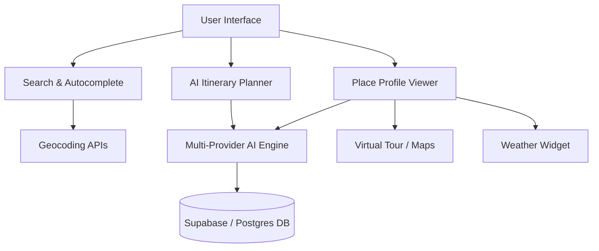

# Chapter 7: System Analysis

## 7.1 Requirement Analysis
The requirement analysis phase identifies the core needs of both travelers and system administrators.
The target user base consists of:
* **Casual Tourists:** Seeking quick logistical info (fees, hours) and local recommendations.
* **Heritage Enthusiasts & Students:** Requiring in-depth historical, architectural, and chronological data.
* **Remote Users:** Requiring high-fidelity virtual exploration capabilities.
* **Evaluators & Presenters:** Requiring a stable, functional application configuration that is immune to API key limits or OAuth redirection issues.

## 7.2 Functional Analysis
The system must be split into independent functional modules to ensure modularity and maintainability:
1. **Directory Engine:** Performs fuzzy lookups against curated data and dynamic queries against geocoding APIs.
2. **AI Synthesis Pipeline:** Runs a sequential cascade of API calls to compile a unified 19-point place guide.
3. **Interactive Visualizer:** Renders 360-degree panoramas, interactive maps, and 7-day weather widgets.
4. **Relational Database Sync:** Manages user state, favorites, and written reviews.
5. **Session Guard:** Manages logins and provides an automated demo fallback.

## 7.3 Technical Analysis
The chosen technical stack (React 19, Vite, TanStack Router, TanStack Start, Supabase, and Nitro) is analyzed for suitability:
* **Vite + React 19:** Yields high-speed builds and efficient state rendering.
* **TanStack Start:** Provides serverless server-side execution (`createServerFn`) that acts as an intermediate proxy, protecting private AI API keys from being exposed to the client.
* **Supabase / PostgreSQL:** Handles relational tables and user security rules via RLS, reducing custom backend coding.
* **Open-Meteo & Nominatim:** Free, open APIs that do not require API keys, minimizing cost.

## 7.4 Feasibility Study
Before starting development, a feasibility study was conducted across three domains:

### 7.4.1 Technical Feasibility
The development team has access to modern web libraries and open APIs. Since all mapping, weather, and AI services are accessed over HTTP requests, no local hardware acceleration is required. Browser-native iframes easily display Street View viewports. Therefore, the project is highly technically feasible.

### 7.4.2 Economic Feasibility
The platform runs on a **Serverless-Relational** model utilizing free tiers:
* **Vercel:** Hobby tier is free for frontend and serverless endpoints.
* **Supabase:** Free tier covers up to 500MB of PostgreSQL data.
* **API Gateways:** OpenStreetMap and Open-Meteo are free.
* **LLM Fallback Engine:** Fails over to local static mock profiles if paid API keys run out of quota, resulting in zero unexpected operational costs.
Therefore, the project is highly economically feasible.

### 7.4.3 Operational Feasibility
The application is accessed through any modern mobile or desktop web browser. It requires no installation, configuration, or specialized hardware on the user's end. The intuitive search-and-click UI makes it simple to operate for travelers of all age groups.

## 7.5 User Requirement Analysis
The user requirements can be mapped as follows:
* **Frictionless Onboarding:** Quick logins with a demo account option to inspect features.
* **Dynamic Information Rendering:** Single-screen access to all necessary logistics, weather, and guides.
* **Itinerary Exporting:** Ability to save custom itineraries and view them on a personal dashboard.
* **Interactive Reviews:** Sharing personal experiences with other travelers.
