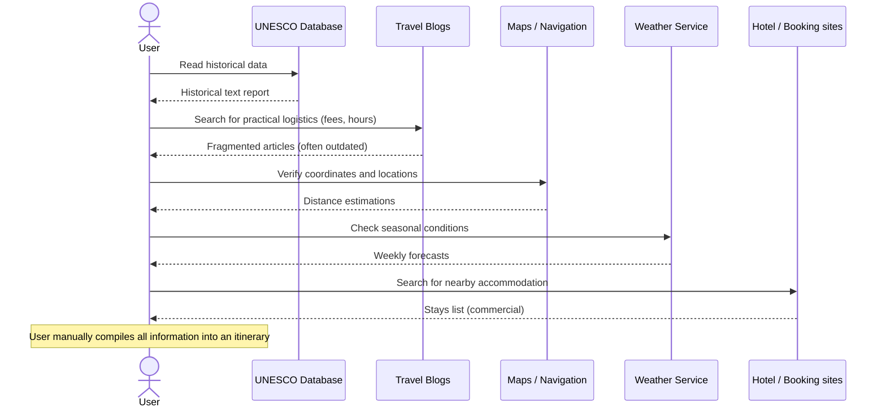

# Chapter 8: Existing System

## 8.1 Overview of Existing Tourism Platforms
The modern digital tourism landscape is dominated by a few large-scale commercial portals and directories. These platforms can be divided into four main categories:
1. **Commercial Booking Aggregators:** TripAdvisor, Expedia, Booking.com.
2. **Search Directories:** Google Travel, Google Maps.
3. **Editorial Travel Publications:** Lonely Planet, Fodor's Travel.
4. **Cultural Conservation Portals:** UNESCO World Heritage Centre databases.

## 8.2 Analysis of Major Portals

### 8.2.1 TripAdvisor
TripAdvisor relies heavily on user-generated content (UGC). It features a directory of hotels, restaurants, and attractions.
* **Workflow:** A user searches for an attraction, views a list of photo uploads, and reads crowdsourced reviews written by other travelers.
* **Focus:** Primarily commercial. The platform promotes booking tickets, reservation vouchers, and sponsored hotel packages.
* **Limitation:** Historical and architectural details are disorganized, relying on random user comments rather than structured educational profiles.

### 8.2.2 Google Travel & Google Maps
Google Travel aggregates airline bookings, hotel rates, and locations.
* **Workflow:** Integrates with Google Maps. Users can find coordinates, check operational hours, and view standard photos.
* **Focus:** Logistics and direction routing.
* **Limitation:** Lacks deep cultural exploration, historical timelines, and structured multi-day heritage planning tools. It does not provide specialized guidelines like photography rules.

### 8.2.3 Lonely Planet
Lonely Planet provides curated, high-quality editorial articles written by professional travel journalists.
* **Workflow:** Users buy digital ebooks or read travel blogs on their website.
* **Focus:** Narrative travel writing and structural recommendations.
* **Limitation:** Static content. The itineraries are pre-written and cannot be customized based on a traveler's specific budget, timeframe, or interests.

### 8.2.4 UNESCO Heritage Portals
The UNESCO portal represents the gold standard for historical and archaeological data.
* **Workflow:** Users search a database of designated World Heritage Sites to read official research reports.
* **Focus:** Academic historical preservation.
* **Limitation:** Extremely dry, text-heavy layout. It lacks modern UI designs, mobile responsiveness, interactive mapping, weather tracking, hotel recommendations, and itinerary tools.

## 8.3 Traditional Tourism Systems
Before digital systems, travelers relied on:
* **Physical Guidebooks:** Heavy, expensive, and quickly became outdated.
* **Local Tour Guides:** Highly variable quality, prone to commission scams, and expensive.
* **Information Counters:** Limited operational hours and physical accessibility boundaries.

The following sequence diagram illustrates the fragmented, high-friction workflow a user must endure in traditional or existing systems to plan a heritage trip:

