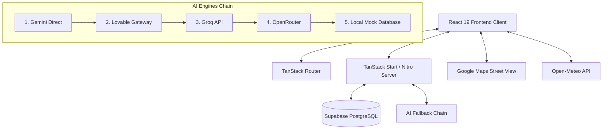
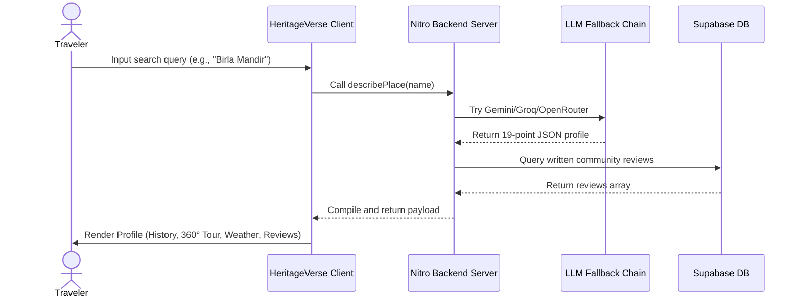

# Chapter 10: Proposed System

## 10.1 Overview of HeritageVerse
HeritageVerse addresses the drawbacks of existing platforms by offering a centralized, AI-orchestrated cultural tourism system. Built using React 19, Vite, TanStack Start, and Supabase, the application acts as an intelligent portal that synthesizes guides, compiles timelines, plans custom itineraries, displays 360° virtual tours, and integrates live weather.

## 10.2 System Architecture
HeritageVerse utilizes a server-client split. The frontend client renders responsive user interfaces using custom CSS layouts. The backend server functions, managed via Nitro and TanStack Start, securely execute server-side logic (such as calling AI APIs and verifying DB states) to protect environment keys.

## 10.3 Core Modules

### 10.3.1 Fuzzy Search & Autocomplete Module
Provides instant text matching. As users type, the query triggers two flows in parallel:
* Lookups against the local curated destination index (`destinations.ts`).
* Real-time geocoding queries against Nominatim and Open-Meteo.
Results are merged and presented in an autocompleted dropdown.

### 10.3.2 Place Compiling Engine
Generates detailed place profiles. When a profile is requested, the system runs the sequential AI fallback pipeline to compile a 19-point guide. This includes history, architectural style, photography guidelines, safety tips, local restaurants, and hotels.

### 10.3.3 Itinerary Concierge Module
Takes user travel preferences (destination, duration, budget, style, and interests) and formats them into a geographic-sequenced timeline. It provides day-by-day themes, morning/afternoon/evening schedules, local culinary suggestions, and cost estimates.

### 10.3.4 Immersive Visualizer
Renders an iframe container embedding Street View panos based on geocoded coordinates, letting users look around the site virtually.

### 10.3.5 Community Feedback Module
Relational tables tracking ratings and text reviews. It queries Supabase and displays community reviews, falling back to simulated reviews if none are available.

## 10.4 System Workflow
The typical user workflow in HeritageVerse is as follows:

