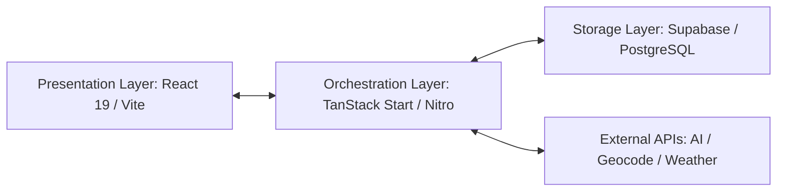
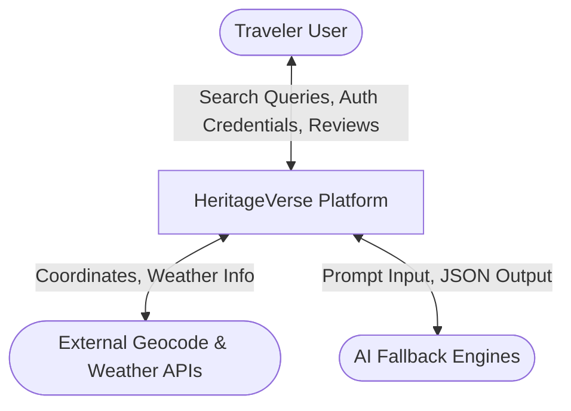
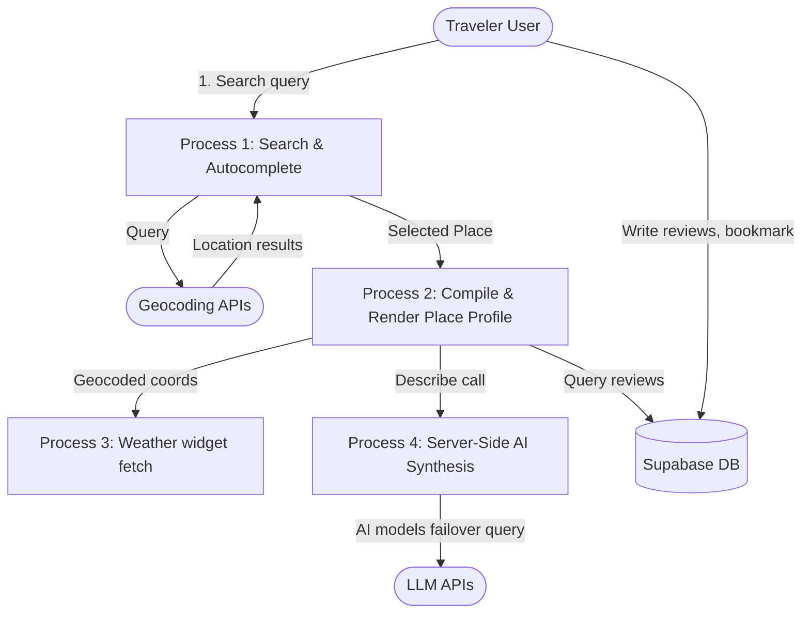
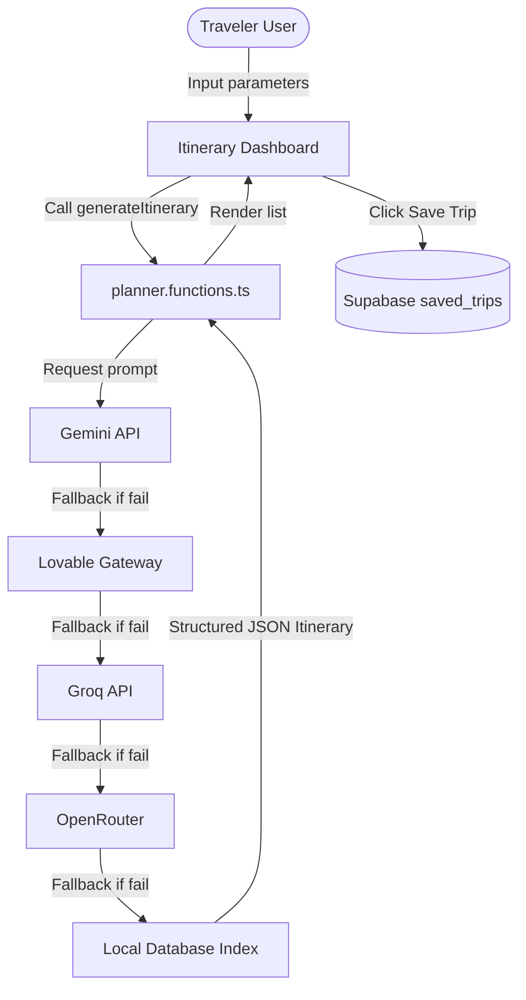
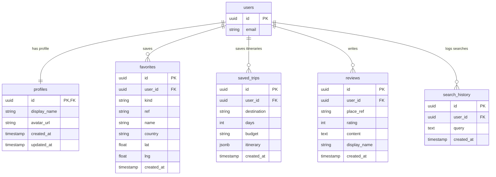

# Chapter 13: System Design

## 13.1 High-Level Design (HLD)
The High-Level Design defines the modular structure of HeritageVerse, dividing the platform into decoupled presentation, orchestration, and storage layers.



## 13.2 Low-Level Design (LLD)
The Low-Level Design details components, routing paths, hooks, and helper functions:
* **Routes:** Route configurations mapped under `/src/routes/` including `/auth`, `/planner`, `/favorites`, and `/place/$name`.
* **Hooks:** State monitors like `useAuth` and `useMobile`.
* **Orchestration Controllers:** `place.functions.ts` and `planner.functions.ts`.

## 13.3 Data Flow Diagrams (DFDs)

### 13.3.1 DFD Level 0 (Context Diagram)
The Context Diagram defines the interaction boundary between the user, external APIs, and the HeritageVerse platform.



### 13.3.2 DFD Level 1 (Process Decomposition)
Decomposes the core processes within the system:



### 13.3.3 DFD Level 2 (AI Itinerary Planning & DB Sync)
Details the data flow within the Itinerary Planning module:



## 13.4 UML Use Case Diagram
The Use Case Diagram displays actor permissions and platform features:

```mermaid
left-to-right direction
actor User as "Traveler User"
actor Guest as "Guest Viewer"

rectangle HeritageVerse {
    usecase "Search Landmarks" as UC1
    usecase "View Place Profiles" as UC2
    usecase "View 360° Tours" as UC3
    usecase "Check Weather Widget" as UC4
    usecase "Use Google Auth Bypass" as UC5
    usecase "Save Favorites" as UC6
    usecase "Create AI Itineraries" as UC7
    usecase "Save Trips" as UC8
    usecase "Write Reviews & Ratings" as UC9
}

Guest --> UC1
Guest --> UC2
Guest --> UC3
Guest --> UC4
Guest --> UC5

User --> UC1
User --> UC2
User --> UC3
User --> UC4
User --> UC6
User --> UC7
User --> UC8
User --> UC9
```

## 13.5 Sequence Diagram
Shows the dynamic sequence of compilation and fallback for a place request:

```mermaid
sequenceDiagram
    actor Traveler
    participant Router as TanStack Router
    participant PlacePage as place.$name.tsx
    participant Server as Nitro Server Function
    participant Gemini as Gemini API
    participant Lovable as Lovable Gateway
    participant LocalDB as Local Mock DB

    Traveler->>Router: Navigate to /place/India Gate
    Router->>PlacePage: Load Component
    PlacePage->>Server: invoke describePlace("India Gate")
    Note over Server: Start AI Fallback Chain
    Server->>Gemini: Fetch profile
    alt Gemini Success
        Gemini-->>Server: Return JSON
    else Gemini Fail / Quota Limit
        Server->>Lovable: Fetch profile via Gateway
        alt Lovable Success
            Lovable-->>Server: Return JSON
        else Lovable Fail
            Server->>LocalDB: Fetch high-fidelity mock profile
            LocalDB-->>Server: Return fallback JSON
        end
    alt Unified JSON Compiled
        Server-->>PlacePage: Return PlaceInfo object
        PlacePage-->>Traveler: Render detailed profile and map
    end
```

## 13.6 Entity Relationship (ER) Diagram
Defines the relational mappings and indexes configured in Supabase:



## 13.7 Database Design & Schema Specifications
* **Cascade Deletes:** Foreign key references in tables like `favorites` and `saved_trips` point to `auth.users(id) ON DELETE CASCADE` to prevent orphaned records.
* **Integrity Constraints:** The `reviews` table includes a check constraint `check (rating >= 1 and rating <= 5)` to enforce rating limits.
* **Row Level Security (RLS) Policies:** Enabled on all tables. Authenticated users can insert, update, or delete rows where `auth.uid() = user_id`.

## 13.8 Deployment Architecture
The platform is deployed using a decoupled, serverless relational design:
* **Vercel Hosting:** Dynamically runs the React build files and hosts the Nitro server functions as serverless lambda routines.
* **Supabase Infrastructure:** Hosts the Postgres instance, handles user token validations, and manages storage.
