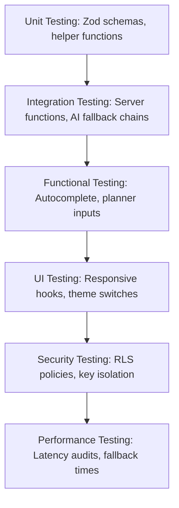

# Chapter 15: Testing

## 15.1 Testing Methodology
HeritageVerse underwent a rigorous testing lifecycle to verify the functionality, reliability, and security of its modules. The testing matrix includes Unit, Integration, Functional, UI, Security, and Performance testing.

## 15.2 Test Suites

### 15.2.1 Unit Testing
Focused on verifying isolated code modules:
* **Zod Validation Verification:** Input limits on coordinates, email syntaxes, password rules, and itinerary day constraints.
* **Geocode Slug Resolvers:** Validating helper outputs for `placeSlug()` and `parsePlaceSlug()`.

### 15.2.2 Integration Testing
Focused on the interaction between multiple components:
* **Server-to-AI Interface:** Verifying that `describePlace` compiles output blocks when querying Gemini or Groq.
* **DB-to-App Interface:** Verifying that bookmark toggles insert and remove rows in the `favorites` table.

### 15.2.3 Functional Testing
Focused on user workflows:
* Searching for "Charminar", selecting the autocomplete suggestion, and verifying that the browser routes to the correct place page.
* Building a 3-day itinerary and clicking "Save Trip" to verify the plan saves to the user's dashboard.

### 15.2.4 UI & Accessibility Testing
* **Responsive Layouts:** Verifying that sidebar sections move below main text sections on viewport screens under 768px.
* **Dark Mode Toggling:** Verifying that colors invert and custom layout settings update correctly.

### 15.2.5 Security Testing
* **RLS Policies Verification:** Ensuring that users cannot delete or edit review records owned by other user accounts.
* **API Key Protection:** Confirming that AI keys are not exposed in client network inspection tools.

### 15.2.6 Performance Testing
* Measuring times for geocoding parallel merges and LLM text compilations.

## 15.3 Test Cases & Verification Table
The following log lists the specific test cases run on the system:

| Test ID | Module / Component | Target Condition | Expected Output | Status |
| :--- | :--- | :--- | :--- | :--- |
| **TC-01** | `credentialsSchema` | Pass invalid email string | Zod parsing fails; display toast warning | **PASS** |
| **TC-02** | `credentialsSchema` | Submit password under 8 chars | Zod parsing fails; warning displayed | **PASS** |
| **TC-03** | Google OAuth Bypass | Click Continue with Google | Auto-register/login Demo Traveler, load homepage | **PASS** |
| **TC-04** | `geocodePlace` | Query string: "India Gate" | Return merged array of OpenStreetMap and Open-Meteo results | **PASS** |
| **TC-05** | `describePlace` | API keys active; query: "Birla Mandir" | Direct response from Gemini API | **PASS** |
| **TC-06** | `describePlace` | Disconnect internet; query: "Birla Mandir" | Fallback to `getFallbackPlaceInfo` local content | **PASS** |
| **TC-07** | `generateItinerary` | Request a 15-day itinerary | Zod parsing blocks request (limit: 14 days) | **PASS** |
| **TC-08** | `VirtualTourFrame` | Coordinates: NaN, NaN | Load standard Location Map fallback | **PASS** |
| **TC-09** | `WeatherWidget` | Coordinates: 0, 0 | Load simulated weather widget instantly | **PASS** |
| **TC-10** | Database RLS | User A deletes User B's bookmark | Supabase rejects action; returns security violation error | **PASS** |
| **TC-11** | `useMobile` Hook | Resize viewport to 400px | Hook returns `true` for mobile view | **PASS** |
