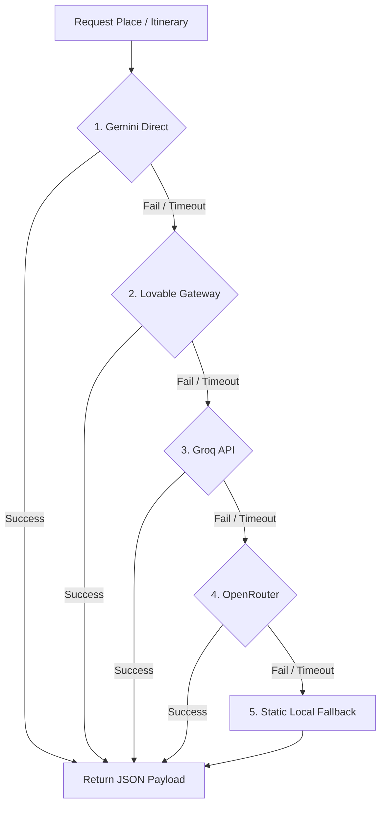
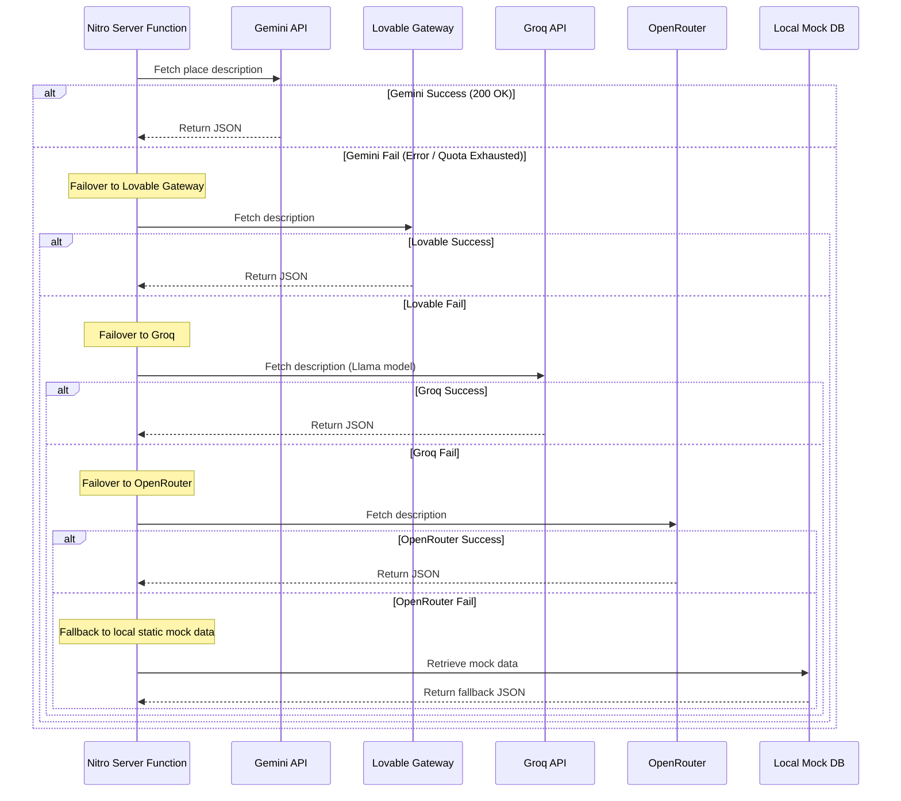

# AI Integration & Failover Architecture

HeritageVerse features a resilient, multi-provider AI engine that compiles detailed profiles and multi-day itineraries on-demand.

---

## 1. Failover Chain Architecture
To ensure high availability and prevent failures due to API rate limits or quota issues, the platform implements a sequential failover cascade:



### 1.1 Failover Sequence

1. **Gemini Direct (`gemini-1.5-flash`):** The primary engine, queried directly via the Google Generative Language API. This is cost-efficient and supports native JSON responses.
2. **Lovable AI Gateway (`gemini-3-flash-preview`):** The first fallback, queried via an intermediate API gateway.
3. **Groq API (`llama-3.3-70b-versatile`):** The second fallback, using Groq's high-speed inference engine.
4. **OpenRouter API (`gemini-2.5-flash`):** The third fallback, routed through OpenRouter's aggregation gateway.
5. **Static Fallback Generator:** The final fallback. If all API requests fail, a local database function is called to return high-fidelity mock data (e.g. for Hyderabad/Birla Mandir, or generic templates for other destinations), preventing application crashes.

---

## 2. Sequence Diagram

The following diagram shows the sequential failover process:



---

## 3. JSON Output Validation
All AI models are instructed to return raw, unformatted JSON that conforms to a strict schema. The output is validated on the client side using **Zod** to catch any formatting or structure changes before rendering:

```typescript
// Example validator snippet
const Input = z.object({
  name: z.string().min(1).max(160),
  country: z.string().max(120).optional(),
  admin: z.string().max(120).optional(),
});
```
This validation enforces structure consistency across all providers.
