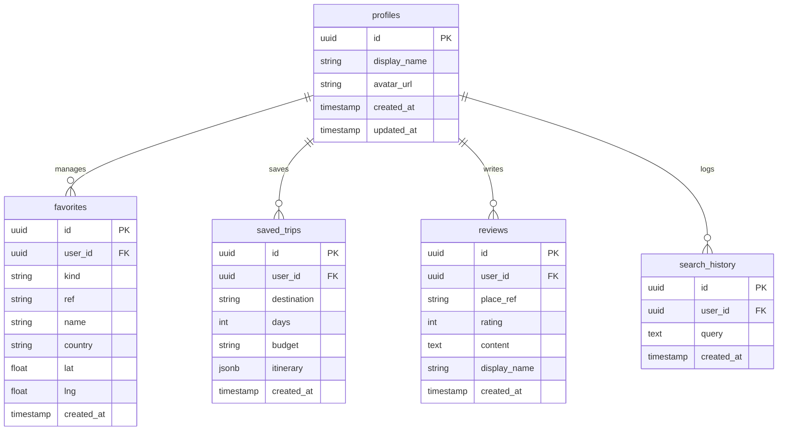

# Database Design & Relational Schema

HeritageVerse uses a **Supabase PostgreSQL** relational database. This document details the tables, relations, triggers, indexes, and security models.



---

## 1. Table Specifications

### 1.1 Profiles Table
Stores user profiles. It is linked to Supabase's internal auth table.
* **Fields:**
  * `id` (`uuid`, Primary Key): References `auth.users(id) ON DELETE CASCADE`.
  * `display_name` (`text`): User's profile display name.
  * `avatar_url` (`text`, Nullable): Link to the user's avatar image.
  * `created_at` (`timestamptz`): Creation timestamp.
  * `updated_at` (`timestamptz`): Update timestamp.

### 1.2 Favorites Table
Stores bookmarked landmarks and curated travel profiles.
* **Fields:**
  * `id` (`uuid`, Primary Key): Auto-generated.
  * `user_id` (`uuid`, Foreign Key): References `auth.users(id) ON DELETE CASCADE`.
  * `kind` (`text`): Must be either `'curated'` or `'place'` (enforced by check constraint).
  * `ref` (`text`): Curated slug identifier or geocoded place identifier.
  * `name` (`text`): Display name of the bookmarked landmark.
  * `country` (`text`, Nullable): Name of the country.
  * `lat` (`double precision`, Nullable): Coordinate latitude.
  * `lng` (`double precision`, Nullable): Coordinate longitude.
  * `created_at` (`timestamptz`): Bookmark timestamp.
* **Constraints:** Unique index on `(user_id, kind, ref)` prevents duplicate bookmarks.

### 1.3 Saved Trips Table
Stores AI-generated travel itineraries.
* **Fields:**
  * `id` (`uuid`, Primary Key): Auto-generated.
  * `user_id` (`uuid`, Foreign Key): References `auth.users(id) ON DELETE CASCADE`.
  * `destination` (`text`): Name of the target destination.
  * `days` (`int`): Duration of the trip.
  * `budget` (`text`): Selected budget tier.
  * `itinerary` (`jsonb`): Nested day-by-day itinerary data.
  * `created_at` (`timestamptz`): Creation timestamp.

### 1.4 Reviews Table
Stores user ratings and written reviews.
* **Fields:**
  * `id` (`uuid`, Primary Key): Auto-generated.
  * `user_id` (`uuid`, Foreign Key): References `auth.users(id) ON DELETE CASCADE`.
  * `place_ref` (`text`): Location key index.
  * `rating` (`int`): Rating value (enforced 1 to 5).
  * `content` (`text`): Written review content.
  * `display_name` (`text`, Nullable): Cached display name of the reviewer.
  * `created_at` (`timestamptz`): Creation timestamp.
* **Constraints:** Enforces `check (rating >= 1 and rating <= 5)`.

### 1.5 Search History Table
Logs user search queries.
* **Fields:**
  * `id` (`uuid`, Primary Key): Auto-generated.
  * `user_id` (`uuid`, Foreign Key, Nullable): References `auth.users(id) ON DELETE CASCADE`. Nullable to permit guest search logs.
  * `query` (`text`): The search string.
  * `created_at` (`timestamptz`): Creation timestamp.

---

## 2. Row Level Security (RLS) Policies

All tables have Row Level Security enabled. Policies restrict operations as follows:

```sql
-- Profiles:
-- Anyone can view profiles, but users can only modify their own profile.
create policy "Profiles are publicly readable" on public.profiles for select using (true);
create policy "Users can insert their own profile" on public.profiles for insert to authenticated with check (auth.uid() = id);
create policy "Users can update their own profile" on public.profiles for update to authenticated using (auth.uid() = id);

-- Favorites:
-- Only the owner can view, insert, or delete bookmarks.
create policy "Users read own favorites" on public.favorites for select to authenticated using (auth.uid() = user_id);
create policy "Users insert own favorites" on public.favorites for insert to authenticated with check (auth.uid() = user_id);
create policy "Users delete own favorites" on public.favorites for delete to authenticated using (auth.uid() = user_id);

-- Saved Trips:
-- Users can manage only their own saved itineraries.
create policy "Users read own saved trips" on public.saved_trips for select to authenticated using (auth.uid() = user_id);
create policy "Users insert own saved trips" on public.saved_trips for insert to authenticated with check (auth.uid() = user_id);
create policy "Users delete own saved trips" on public.saved_trips for delete to authenticated using (auth.uid() = user_id);

-- Reviews:
-- Anyone can view reviews, but only the owner can insert, edit, or delete them.
create policy "Reviews are publicly readable" on public.reviews for select using (true);
create policy "Users insert own reviews" on public.reviews for insert to authenticated with check (auth.uid() = user_id);
create policy "Users update own reviews" on public.reviews for update to authenticated using (auth.uid() = user_id);
create policy "Users delete own reviews" on public.reviews for delete to authenticated using (auth.uid() = user_id);
```

---

## 3. Database Triggers & Functions

### 3.1 Automated Profile Generation
The database automatically creates a profile record in `public.profiles` when a user completes registration via Supabase Auth:

```sql
create or replace function public.handle_new_user()
returns trigger
language plpgsql
security definer
set search_path = public
as $$
begin
  insert into public.profiles (id, display_name, avatar_url)
  values (
    new.id,
    coalesce(new.raw_user_meta_data->>'display_name', new.raw_user_meta_data->>'full_name', split_part(new.email, '@', 1)),
    new.raw_user_meta_data->>'avatar_url'
  )
  on conflict (id) do nothing;
  return new;
end;
$$;

create trigger on_auth_user_created
  after insert on auth.users
  for each row execute function public.handle_new_user();
```
