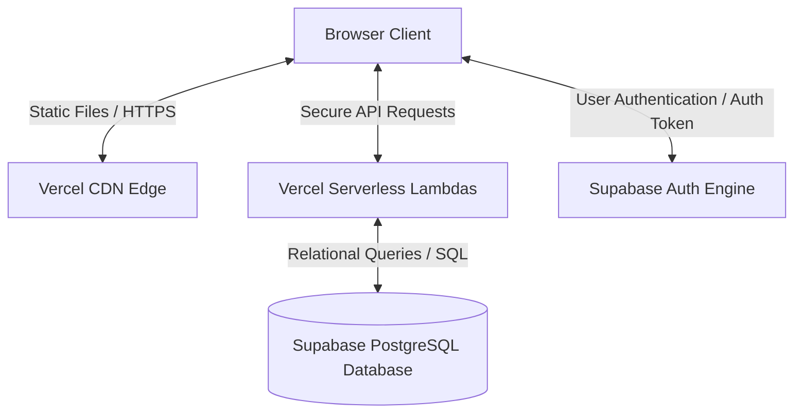

# Deployment & Production Architecture

HeritageVerse runs on a modern, serverless production architecture, utilizing Vercel and Supabase.



---

## 1. Hosting Services

### 1.1 Vercel Hosting
Vercel is the primary host for the application:
* **Frontend Delivery:** Static assets (HTML, CSS, JS) are built using Vite and distributed globally via Vercel's Edge CDN.
* **Serverless Functions:** Server functions are compiled into serverless lambda functions, running on AWS Lambda infrastructure managed by Vercel. These scale dynamically to match incoming traffic.

### 1.2 Supabase Infrastructure
Supabase provides the backend database and authentication layers:
* **PostgreSQL Relational Engine:** A dedicated database instance storing the relational tables.
* **Supabase Auth:** Manages user authentication, token storage, and session security.
* **Connection Pooling:** Uses PgBouncer connection pooling to handle connections from stateless serverless functions.

---

## 2. Environment Variables & Secret Configuration
Private API keys are stored in the hosting environment config rather than compiled in client code:

| Key Name | Sourced By | Purpose / Usage Scope | Required |
| :--- | :--- | :--- | :--- |
| `SUPABASE_URL` | Supabase / Client | Public address of the PostgreSQL database engine. | **Yes** |
| `SUPABASE_ANON_KEY` | Supabase / Client | Public key for database REST and client calls. | **Yes** |
| `GEMINI_API_KEY` | describePlace | Private API key for Google Gemini model requests. | **No** (Optional) |
| `GROQ_API_KEY` | describePlace | Private API key for Groq API (Llama models) requests. | **No** (Optional) |
| `OPENROUTER_API_KEY` | describePlace | Private API key for OpenRouter models. | **No** (Optional) |

---

## 3. Production Deployment Flow
1. **Developer Push:** Code is pushed to the target repository (e.g. on GitHub).
2. **Build and Test Trigger:** Vercel catches the repository commit and runs the build command:
   ```bash
   npm run build
   ```
3. **Asset Optimization:** Vite compiles React components, routes, and custom styles, outputting static files and backend serverless endpoints.
4. **Deploy Assets:** Static assets are deployed to Vercel's global CDN nodes, while server functions are deployed as Serverless Lambda functions.
5. **Database Migration:** Supabase migrations are run against the PostgreSQL database instance.
6. **Live Production:** The new build goes live.
